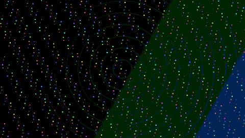
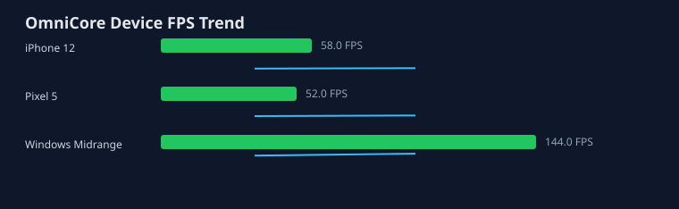
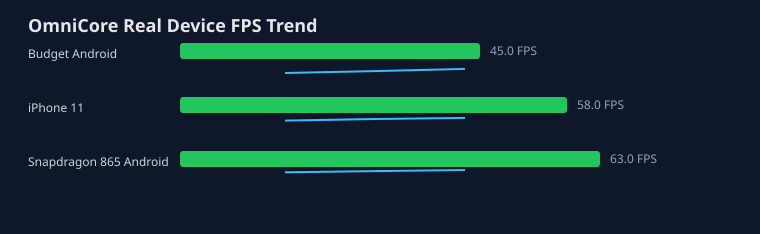
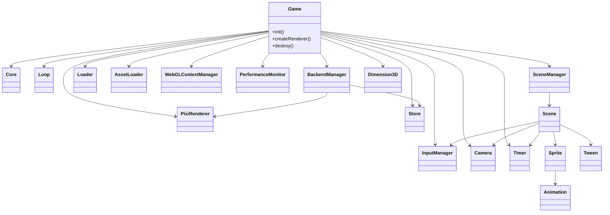

# OmniCore v1.0.0

OmniCore: 33KB Lean Core Web 游戏引擎，1000 Sprite 演示目标 144 FPS。

<p>
  
</p>

<p>
  <a href="#快速开始"></a>
  <a href="./examples/market-showcase/"></a>
  <a href="./docs/public-release-evidence.md"></a>
  <a href="https://github.com/wwu79090-png/omnicore"></a>
</p>


OmniCore 是一个 HTML5 2D/2.5D 优先游戏引擎骨架：默认使用 PixiJS v8 做 2D 渲染，提供 Phaser 风格场景栈和 Tween、Construct/GDevelop 风格 JSON Event Sheet、Cocos 风格 `addComponent()`，并把 Three.js 作为独立的装饰背景层延迟加载。

OmniCore 专注于 2D 游戏开发和有限 2.5D 表现，明确不是全 3D 引擎。`Dimension3D` 支持多个装饰性 `.gltf` / `.glb` 模型、基础遮罩排序、预设动画播放和点击事件，用来增强 2D 场景表现；2.5D 层只提供 Z 轴到 2D Y 轴的遮挡排序与投影碰撞辅助，不提供全 3D 物理、自由 3D 摄像机控制或 3D 玩法框架。

它有意不内置物理系统；物理只通过 `loadPhysics()` 延迟加载适配器。OmniCore 不暴露 Pixi ticker，不生成 UI 源码，不依赖大型编辑器。输入、Camera、Timer、Animation 是轻量基础模块，随 `Game` 和 `Scene` 生命周期更新。

官网首页提供《代码觉醒者》先发案例入口、`examples/full-game-demo/` 30 分钟微型完整游戏、`examples/market-showcase/` 市场展示 demo 和公开路线图。匿名遥测默认关闭；只有开发者显式传入 `telemetry: { anonymous: true }` 时才会在本地生成引擎版本、错误类型和 API 使用频率的聚合摘要，不会自动上传网络。

## 最新动态

- [每月开发进度总结](website/news/)：运行时健康遥测、弱网与低内存模拟、版本发布说明和社区案例展示。

## 在线体验

- 当前可验证体验路径：克隆仓库后运行 `npm install && npm run dev`，打开 `website/index.html`、`website/playground/`、`website/editor/` 或 `examples/market-showcase/`。
- 市场展示 Demo：[`examples/market-showcase/`](examples/market-showcase/)
- 性能热路径 Demo：[`examples/performance-hot-paths-demo`](examples/performance-hot-paths-demo/) 展示 batching、对象池、dirty sync 和 WebGPU descriptor 证据。
- 在线官网部署状态：待重新绑定真实引擎站点；`https://omnicore.vercel.app/` 当前不是 OmniCore 引擎主页，暂不作为公开体验入口。
- NPM 发布状态：待公开发布；`omnicore` 当前在 npm registry 查询不到，发布前请使用 GitHub 源或本地包验证。
- 发布证据与待补项：[`docs/public-release-evidence.md`](docs/public-release-evidence.md)

## 默认不限 FPS 与性能热路径证据

OmniCore 默认不限 FPS，不在引擎层把渲染锁死到 60 FPS；实际帧率由浏览器、显示刷新率、设备负载和渲染后端共同决定。高刷新屏验证入口见 [`docs/performance/real-device-uncapped-fps.md`](docs/performance/real-device-uncapped-fps.md)，可运行 `npm run performance:uncapped-evidence` 生成 JSON 与 Markdown 证据。

性能治理不只看单次截图：`npm run performance:hot-paths-gate` 会检查 render queue batching、runtime object pools、dirty sync、tilemap streaming、animation LOD 和 WebGPU descriptors；`npm run types:coverage` 会确认这些 hot-path API 已同步出现在 `dist/omnicore.d.ts`。可视化演示入口是 [`examples/performance-hot-paths-demo`](examples/performance-hot-paths-demo/)。

## AI 加速开发

OmniCore 是一个学生/小团队风格的真实开源项目：资源有限，所以开发过程尽量把 AI 当成“加速器”而不是“替代者”。AI 主要参与重复性的脚手架、测试补全、文档草稿、发布检查清单和错误复盘；架构取舍、性能目标、API 边界、最终验收和社区反馈仍由作者手动把关。

这个工作流让项目能在较短周期里持续补齐编辑器、资源流水线、测试门禁、微信小游戏构建和性能治理，但 README 里的数据只保留可验证结果：Lean Core ESM 约 33KB、`dist/omnicore.esm.js` 可构建、800+ 个自动化检查全绿、依赖高风险项为 0。公开 npm 包和在线官网需要完成真实发布后再切回正式链接。

## 快速开始

### 10 分钟极简教程：三行画出第一个角色

准备一个页面容器：

```html
<div id="app"></div>
```

安装后在入口文件中写入 3 行代码：

```js
const game = await new OmniCore.Game({ parent: '#app', renderer: 'canvas' }).init();
const scene = Object.assign(new OmniCore.Scene('play'), { create() { this.add(new OmniCore.Sprite('hero', { x: 120, y: 120, width: 48, height: 48, color: '#38bdf8' })); } });
game.scene.register(scene); await game.scene.push('play');
```

完整可复制版本见 [`docs/ten-minute-quickstart.md`](docs/ten-minute-quickstart.md)。

常用 API 和迁移片段见 [`docs/api-cookbook.md`](docs/api-cookbook.md)。想直接从可玩工程开始，可以打开官方模板：

- [`examples/official-templates/platformer`](examples/official-templates/platformer/)
- [`examples/official-templates/rpg-dialogue`](examples/official-templates/rpg-dialogue/)
- [`examples/official-templates/bullet-heaven`](examples/official-templates/bullet-heaven/)

### 安装

```bash
npm install omnicore
```

> 公开 npm 包发布前，`npm install omnicore` 可能返回 404。当前可用验证方式是克隆 GitHub 仓库运行 `npm install && npm run build`，或在本机通过 `npm pack --dry-run` 检查将要发布的包内容。

中国大陆网络环境如果 `npm install` 卡在 `registry.npmjs.org` 超时，先执行国内镜像源一键配置命令：

```bash
npm config set registry https://registry.npmmirror.com/
npm install omnicore
```

OmniCore 的 `preinstall` 检查也会在官方源连接超时时打印同样的处理指引，不会静默失败。

```js
import OmniCore, { Scene, Sprite, Tween } from 'omnicore';

class PlayScene extends Scene {
  create() {
    const hero = this.add(new Sprite('hero', { x: 80, y: 160 }));
    this.move = new Tween(hero, {
      x: { from: 80, to: 520 },
      duration: 900,
      ease: 'inOutCubic',
      yoyo: true,
      repeat: Infinity
    });
  }

  update(delta) {
    this.move.update(delta * 1000);
  }
}

const game = await new OmniCore.Game({
  parent: '#app',
  width: 960,
  height: 540,
  renderer: 'pixi', // or 'auto'
  platform: 'web',
  debug: true,
  onStart: () => console.log('started'),
  onPause: () => console.log('paused'),
  onResume: () => console.log('resumed')
}).init();

game.scene.register(new PlayScene('play'));
game.scene.push('play', { fadeIn: 200 });
```

## 六大核心模块

- `Core`：Canvas/WebGL 上下文管理、自动降级、`autoResize`。
- `Renderer`：PixiJS v8 封装，提供 `applyBloom()`、`applyGlitch()`、`applyAdjustment()`，Canvas fallback。
- `WebGLContextManager`：监听 `webglcontextlost/restored`，恢复失败时降级 Canvas。
- `Loop`：`requestAnimationFrame`、60 FPS fixed-step、delta 插值、页面隐藏自动暂停恢复。
- `SceneManager`：场景栈 `push/pop/replace`、`fadeIn/fadeOut`、pop 自动销毁资源。
- `Store`：基于 Nano Stores，渲染后端切换时重新注入 `backend`。
- `Loader`：`asset-manifest.json` 预检、`loadBundle()` 按需加载、5 秒超时、重试、友好错误。
- `AssetLoader`：单图加载失败时不打断流程，自动生成 Pixi.Graphics 占位方块。
- `Input`：键盘状态和指针事件，`SceneManager.update()` 会在 `Scene.update()` 前刷新。
- `Camera`：`follow()`、`zoom()`、`shake()`，注入为 `game.camera` 和 `scene.camera`。
- `Timer`：`delay()`、`interval()`，由 `Game.loop` 驱动，注入为 `scene.timer`。
- `Animation`：SpriteSheet 帧控制，支持 `play()`、`stop()`、`update()`。
- `Node/Prefab`：节点树 `addChild/getChild/removeChild`，支持嵌套预制体和路径属性覆盖。
- `Database`：RPG 数据配置中心，加载 `items/enemies/skills/states` JSON，并通过 `DB.get(type, id)` 读取。
- `Timeline`：JSON 时间线动画，支持关键帧、缓动和事件钩子。
- `VisualEventGraph`：`debug: true` 下启用的可视化事件图编辑器，可导出 Event Sheet JSON。
- `RendererManager`：`renderer: 'auto'` 时执行 Pixi -> Canvas 自动降级。
- `HotReload/AIImporter/Worker/Plugin Store`：热更新、自然语言场景导入、多线程任务卸载和 CDN 插件协议。

## API

```js
new OmniCore.Game(config);
new OmniCore.Scene(name);
new OmniCore.Sprite(texture);
new OmniCore.Tween(target, config);
new OmniCore.UI.Button(text, options);
OmniCore.Prefab.instantiate(json, x, y);
await OmniCore.Backend.switch('pixi'); // 'pixi' | 'canvas' | 'webgl' | 'auto'
await OmniCore.install('plugin-name');
```

`OmniCore.Backend.switch()` 是实验性高阶功能。它会触发 `switchStart`，暂停 Loop，销毁当前 2D Renderer，释放 WebGL 状态，清理容器 canvas，新建 canvas 并重建后端，重新注入 Store，重绘当前场景，然后触发 `switchComplete`。不要在普通帧循环里频繁调用它。

## 开发者体验入口

- `OmniCore.help('Game')`：打印 API 描述、参数签名、示例代码和返回值说明。
- `OmniCore.Console.analyzeError(error)`：基于规则库输出中文错误诊断和文档链接。
- `debug: true`：启用 TutorialGuide、Live Inspector、性能面板和开发者使用报告。
- `examples/playground.html`：无需本地构建的示例库页面，点击即可运行 ES module 示例。
- `website/playground/index.html`：在线 IDE，编辑代码并实时预览。
- `npm run deploy -- --target vercel`：构建、压缩资源并执行 CDN 部署流程。
- `omni-migrate --root src --report docs/release-notes/migration-report.json`：扫描并重写 v1.x 到 v2.x 的旧 API。

## 运行时健康遥测与隐私

运行时健康遥测默认关闭。只有开发者显式传入 `telemetry: { enabled: true }`，OmniCore 才会在用户设备上生成匿名聚合摘要；如果没有配置 `endpoint` 或 `transport`，数据不会离开本机。

```js
const game = await new OmniCore.Game({
  telemetry: {
    enabled: true,
    anonymous: true,
    intervalMs: 15000,
    endpoint: '/api/telemetry'
  }
}).init();
```

采集内容仅限 FPS、JS heap 内存估算、渲染后端、WebGL 丢失/恢复状态、场景名、错误类型计数和引擎版本。默认接收端 `api/telemetry.js` 写入 JSONL，可通过 `OMNICORE_TELEMETRY_FILE` 指定本地文件。不会采集用户身份、IP、输入内容、资源 URL、本地路径、存档数据或业务表数据；线上开启前应在游戏自己的隐私政策中说明用途和保留周期。

## 旧游戏迁移痛点

HTML 覆盖层放在 Canvas 上方时，先让覆盖层消费事件，避免按钮点击穿透到 Pixi 背景：

```js
const disposeOverlayInput = game.input.pointer.enableEventPropagation(document.querySelector('#hud'));
```

键盘默认忽略 `INPUT` 和 `TEXTAREA`，迁移表单时不会抢走玩家输入。需要扩展标签时可传入：

```js
const game = await new OmniCore.Game({
  input: {
    keyboard: { ignoreTags: ['INPUT', 'TEXTAREA', 'SELECT'] }
  }
}).init();
```

旧 Phaser/localStorage 存档可以直接映射进 OmniCore Store：

```js
OmniCore.Storage.importLegacy('phaser-save', {
  'player.name': 'profile.name',
  level: 'progress.level',
  gold: ({ legacy }) => legacy.inventory.coins
}, { store: game.store });
```

调试迁移节点时，`debug: true` 会启用命名检查点：

```js
game.store.snapshot('node-03');
game.store.loadSnapshot('node-03');
```

```js
const game = await new OmniCore.Game({
  parent: '#game-container',
  renderer: 'pixi',
  switchStart: (backend) => status.textContent = `切换到 ${backend} 中...`,
  switchComplete: (backend) => status.textContent = `当前后端：${backend}`
}).init();

await OmniCore.Backend.switch('canvas');
```

## Input

```js
class PlayScene extends OmniCore.Scene {
  update() {
    if (this.input.keyboard.isDown('KeyA')) {
      this.player.x -= 4;
    }
  }
}

game.input.pointer.on('click', ({ x, y }) => {
  console.log('click', x, y);
});
```

`InputManager` 使用 `pointerdown/pointerup/pointermove` 统一鼠标、触控和手写笔事件，默认对触屏事件执行 `preventDefault()`，避免移动端滚动、缩放或长按菜单干扰游戏画面。窗口 resize 时会按 `devicePixelRatio` 重算 canvas 像素尺寸和 `resolution`，防止移动端拉伸。

## Camera

```js
scene.camera.follow(player, { lerp: 0.15 });
scene.camera.zoom(1.5);
scene.camera.shake(160, 6);
```

## Timer

```js
scene.timer.delay(500, () => scene.game.scene.push('menu'));
scene.timer.interval(1000, () => spawnEnemy());
```

## Animation

```js
const run = new OmniCore.Animation(sprite, {
  run: ['run-0', 'run-1', 'run-2', 'run-3']
}, { frameRate: 12 });

sprite.addAnimation(run);
run.play('run');
```

## Advanced Capabilities

新增高级能力均为按需加载模块，迁移说明见 `docs/advanced-capabilities.md`：

- `OmniCore.Node`：节点树和嵌套预制体。
- `OmniCore.DB` / `OmniCore.Database`：RPG 数据表。
- `OmniCore.Timeline`：JSON 时间线动画。
- `OmniCore.VisualEventGraph`：可编译为 EventSheet 的事件/条件/动作逻辑图；桌面编辑器提供 Flow Graph 面板。
- `OmniCore.Payment`：官方支付接口 addon，统一 `requestPayment(order)`，由平台插件注册真实 provider。
- `OmniCore.Ad`：官方广告接口 addon，统一激励视频和 banner 广告入口。
- `OmniCore.RendererManager`：多渲染后端自动降级。
- `OmniCore.HotReload`：开发期资源和配置热更新。
- `OmniCore.AIImporter`：自然语言生成 `Scene.json`。
- `OmniCore.Worker` / `OmniCore.WorkerManager`：Worker 任务卸载。
- `OmniCore.install()`：插件市场安装协议。
- `OmniCore.WebGPURenderer`：WebGPU 入口和 OffscreenCanvas Worker 绘制指令桥。
- `OmniCore.SpineAdapter` / `OmniCore.DragonBonesAdapter`：骨骼动画状态播放 MVP。
- `OmniCore.Light2D`：点光源、平行光和 Tilemap/矩形遮挡阴影辅助。
- `OmniCore.Input.Sequence`：QTE/连招按键序列识别。
- `OmniCore.UI.UIButton` / `UITextInput` / `UIScrollView`：纯 Canvas UI 控件。
- `OmniCore.Net.Room`：房间式 WebSocket 通信。
- `OmniCore.CrashReporter`：Store、性能指标、操作日志和错误远程上报。

## 商业引擎对标 MVP

```js
const game = await new OmniCore.Game({
  renderer: 'auto',
  framerateCap: 'auto',
  vsync: true,
  crashReporter: { endpoint: '/api/crash' }
}).init();

const room = new OmniCore.Net.Room({ url: 'wss://example.com/room' });
room.join('arena-1', { playerId: 'p1' });

const sequence = new OmniCore.Input.Sequence({ events: game.events });
sequence.define('dash', ['KeyA', 'KeyD', 'Space']);
```

`renderer: 'auto'` 在 WebGPU 可用时优先尝试 WebGPU，然后回退 Pixi/Canvas；`renderer: 'webgpu'` 可显式请求 WebGPU。当前 WebGPU Worker 管线是 MVP：主线程生成绘制指令，OffscreenCanvas Worker 桥负责跨线程提交消息，后续可替换为真实纹理上传和 GPU command encoding。

## Optional MicroKernel

微内核、Addon 插件系统、骨架屏和渲染器抽象默认不启用。旧项目无需改动；只有显式传入
`microkernel.enabled: true` 时，`OmniCore.Game` 才会动态加载桥接层：

```js
const game = await new OmniCore.Game({
  parent: '#app',
  renderer: 'canvas',
  microkernel: {
    enabled: true,
    splash: {
      text: 'OmniCore MicroKernel Booting...',
      autoHide: true
    },
    renderer: {
      adapter: 'auto',
      candidates: ['pixi', 'canvas']
    },
    addons: {
      telemetry: {
        init(kernel) {
          kernel.context.game.events.emit('telemetry:ready');
        },
        destroy() {}
      }
    },
    use: ['telemetry']
  }
}).init();
```

新增文件位于 `src/microkernel/`，桥接层位于 `src/bridge/`，基础 addon 位于 `src/addons/`。
该模式不修改 `OmniCore.Game` 的公共 API，也不替换现有 Store、Scene、Renderer 生命周期。

## 测试与性能优化

微内核测试集中放在 `tests/microkernel/`：

- `kernel.test.js`：覆盖 Addon 重复注册警告、RAF 脏检查微循环、骨架屏 show/hide 时序。
- `renderer-bridge.test.js`：覆盖 Pixi/GPU 不可用时降级到 Canvas、Canvas 从最后绘制指令回放画面、桥接调度器拆分。

微内核渲染使用脏检查节流：`Kernel.updateEntity(id, patch)` 和 `Kernel.set(key, value)` 只记录最新值，
并在下一次 `requestAnimationFrame` 中把本帧 dirty 数据交给渲染层。开发模式下单帧绘制指令超过 100 条时，
日志输出 `[OmniCore] performance warning`，用于定位过度绘制。

`src/addons/PixiRenderer.js` 和 `src/addons/CanvasRenderer.js` 共享 `drawRect()`、`drawText()` 接口。
Pixi 初始化失败或 GPU/WebGL 不可用时，`RendererAdapter` 会降级到 Canvas，设置
`renderer:filtersEnabled = false`，并让 Canvas 从 `microkernel:drawCommands` 回放最后一帧无滤镜画面，
确保降级后至少保持相同的基础几何和文本内容。

## 大地图性能系统

`OmniCore.ViewportCulling` 用于大型 RPG 地图的可见性剔除。实体在视口外时会同时跳过 `update()` 和渲染同步；实体可通过 `cullable: false`、`alwaysUpdate` 或 `alwaysRender` 退出剔除。Tilemap 类对象可调用 `visibleTileChunks(tilemap, chunkSize)` 只处理当前视口内区块。

```js
const game = await new OmniCore.Game({
  parent: '#app',
  renderer: 'auto',
  culling: {
    enabled: true,
    padding: 96,
    viewport: { x: 0, y: 0, width: 960, height: 540 }
  }
}).init();
```

`OmniCore.SleepWakeSystem` 用于 NPC/敌人休眠。带有 `kind: 'npc'`、`kind: 'enemy'`、`tags: ['npc']` 或 `sleepable: true` 的实体会根据玩家距离自动停止和恢复逻辑更新。

```js
const game = await new OmniCore.Game({
  sleepWake: { enabled: true, distance: 768, wakeDistance: 560 }
}).init();

game.player = hero;
enemy.kind = 'enemy';
```

## Behavior Tree

Event Sheet 仍适合简单条件/动作表；复杂 AI 推荐使用 `OmniCore.BehaviorTree`。它使用 JSON 描述 `selector`、`sequence`、`repeat`、`condition` 和 `action`，可表达“如果 A 存在且 B 距离小于 5，则执行 C，否则执行 D”。

```js
const tree = OmniCore.BehaviorTree.fromJSON({
  type: 'selector',
  children: [
    {
      type: 'sequence',
      children: [
        { type: 'condition', op: 'exists', target: 'entities.player' },
        { type: 'condition', op: 'distanceLessThan', left: 'entities.player', right: 'entities.enemy', distance: 5 },
        { type: 'action', op: 'call', name: 'attack' }
      ]
    },
    { type: 'action', op: 'call', name: 'patrol' }
  ]
});

tree.tick({ entities, actions });
```

## Worker 任务卸载

`OmniCore.WorkerManager` 现在内置 `astar`、`batchCollisions` 和 `mapPaths`。浏览器环境会通过 Web Worker 执行，测试或不支持 Worker 的环境自动回退主线程；`runSynced()` 可把结果写回 Store，完成主线程/子线程数据同步。

```js
const worker = new OmniCore.WorkerManager().registerBuiltins();
const path = await worker.run('astar', { start, goal, grid });
const pairs = await worker.run('batchCollisions', { rects });
await worker.runSynced('mapPaths', { requests, grid }, { store: game.store, key: 'aiPaths' });
```

## 在线场景编辑器

免费 Web 在线编辑器位于 `website/editor/index.html`，设计目标域名为 `editor.omnicore.dev`。它使用 OmniCore 自身启动 Canvas 画面，支持拖拽方块、属性面板实时修改 `x/y/scale/rotation`、保存到 `localStorage` 和导出标准 `Scene.json`。

```bash
npm run dev
# 打开 http://127.0.0.1:5173/website/editor/index.html
```

## 商业导出付费墙

一键导出微信小游戏、抖音小游戏和 HTML5 平台包被包装为商业版能力。开源运行时不受影响；只有 `npm run export:platform` 需要 `OMNICORE_PRO_LICENSE` 或 `--license`。

```bash
npm run export:platform -- --target html5 --out dist/html5 --license OMNI-PRO-TEST
npm run export:platform -- --target wechat --out dist/wechat --license OMNI-PRO-TEST
npm run export:platform -- --target douyin --out dist/douyin --license OMNI-PRO-TEST
```

## 集成测试与每日构建

真实集成测试使用 Playwright 打开在线编辑器，模拟玩家拖拽、点击保存，并与 `tests/e2e/__screenshots__/editor-baseline.png` 做截图基准比对。首次运行会生成基准图，之后运行会按像素差异阈值检查 UI 是否错位。

```bash
npm run test:e2e
```

每日自动构建位于 `.github/workflows/daily-dev-build.yml`：北京时间每天 00:00 运行 `npm test` 与 `npm run build:prod`，上传构建产物，并把可运行快照推送到 `dev` 分支。

## 真实设备长期性能基线

OmniCore 现在把真实设备性能样本维护在 `docs/performance/device-baselines.json`，覆盖 Pixel 5、iPhone 12 和 Windows 中端机的 `complex-scene-benchmark` 历史记录。README 展示的趋势图由同一份 JSON 生成，便于持续和市场引擎做帧率、P95 帧时与内存对标。



```bash
npm run benchmark:device-baseline -- --sample reports/device-sample.json
```

## OmniCore 在 iPhone 11 上的长期帧率表现

`docs/hardware-baseline/` 保存真实设备长期基线，当前覆盖 iPhone 11、骁龙 865 安卓机和百元级 Android。每台设备定期执行 `npm run benchmark:mobile`，再通过 `npm run benchmark:hardware-baseline -- --sample reports/mobile-sample.json` 回填 JSON 并生成官网趋势图。



## JSON Event Sheet

```js
const sheet = OmniCore.EventSheet.parse({
  events: [
    {
      conditions: [{ op: 'equals', left: 'state.score', right: 5 }],
      actions: [{ op: 'set', target: 'state.level', value: 2 }]
    }
  ]
});

sheet.run({ state: { score: 5 } });
```

## 组件挂载

```js
class Health {
  constructor(owner, { hp }) {
    this.owner = owner;
    this.hp = hp;
  }
}

const hero = new OmniCore.Sprite('hero');
hero.addComponent(Health, { hp: 10 });
```

## 3D 装饰背景层

```js
const game = await new OmniCore.Game({
  parent: '#game',
  renderer: 'pixi',
  dimension3D: {
    canvas: document.querySelector('#background-3d'),
    decorativeModel: {
      url: '/models/cyberpunk-city.glb',
      position: { x: 0, y: -1.2, z: -8 },
      scale: 1.4,
      rotationSpeed: { y: 0.08 }
    }
  }
}).init();
```

也可以单独使用：

```js
const dimension = await new OmniCore.Dimension3D({
  canvas: document.querySelector('#background-3d'),
  decorativeModel: { url: '/models/cyberpunk-city.gltf', rotationSpeed: { y: 0.08 } }
}).init();

const hero = await dimension.addModel(
  'hero',
  '/models/hero.glb',
  { x: 1.2, y: -0.4, z: -3 },
  { x: 1, y: 1, z: 1 }
);

hero.playAnimation('Idle');
hero.rotateY(0.2);
hero.on('click', ({ model }) => {
  console.log(`${model.name} clicked`);
});
dimension.sortModelsForMasking({ zToYScale: 1, startRenderOrder: 10 });

dimension.render(1 / 60);
```

`Dimension3D` 拥有单独 canvas、scene 和 renderer；销毁或切换 2D 后端不会影响 3D 背景。该层是纯装饰能力，`capabilities.decorativeOnly === true`，可通过 `addModel(name, glbPath, position, scale)` 同时加载多个 glTF/GLB 模型。返回的模型对象提供 `playAnimation(name)`、`rotateY(speed)` 和 `on('click', callback)`，用于预设动画播放、简单旋转和把 3D 点击转回 2D 游戏交互。`sortModelsForMasking()` 会按模型 `y + z * zToYScale` 写入稳定 `renderOrder`，服务于 2D/2.5D 混排时的基础遮罩排序。

2.5D 能力边界是固定的：只提供装饰性多模型渲染、基础遮罩排序、预设 `AnimationMixer` 动画播放和 `Raycaster` 点击事件。它拒绝提供全 3D 物理、自由 3D 摄像机控制、OrbitControls、PointerLockControls 或 3D 玩法框架；需要这些能力时应接入专门 3D 引擎，而不是把 OmniCore 的 2.5D 层扩展成完整 3D 运行时。

## 跨平台

- `platform: 'web'`：标准浏览器运行。
- `platform: 'electron'`：`PlatformAdapter.generateElectronFiles()` 生成 `electron/main.js` 和 `electron/preload.js`。
- `platform: 'wechat'`：`PlatformAdapter.adaptWechat(wx)` 适配微信小游戏 canvas、storage 和 raf 接口。
- `detectEnvironment()`：自动识别 Web/Electron/微信小游戏/抖音小游戏。小游戏环境下 `fetcher` 会替换为 `wx.request`/`tt.request` 包装器，并跳过 `pixi-viewport`、Three.js 等重型运行时加载。
- `OmniCore.System.Auth`：实名认证钩子，只定义统一调用面，不绑定具体服务商。

## 调试

`debug: true` 时启用：

```js
OmniCore.lookup('game');
OmniCore.lookup('renderer');
OmniCore.lookup('store');
OmniCore.lookup('scene');
```

同时会启用右上角性能面板，展示 FPS、渲染耗时、活跃 GameObject 数量和 JS heap 内存。FPS 连续低于 30 时，开发环境会输出 `[OmniCore] [Performance] FPS 低于 30` 预警。`Logger.error()` 会把最近一次错误写入 `window.__OmniCore_LastError`，包含时间戳、scope、文件路径、行号和 stack，便于线上问题回溯。

生产构建中日志通过 `import.meta.env.PROD` 静默，并由 Vite 生产配置剥离 `console`/`debugger` 调用。

## Mermaid 类图



## 目录结构

```text
src/
  index.js
  addons/Audio.js
  addons/CanvasRenderer.js
  addons/PixiRenderer.js
  animation/Animation.js
  audio/AudioManager.js
  bridge/OmniCoreBridge.js
  camera/Camera.js
  compliance/AuthManager.js
  core/Bootstrap.js
  core/EventBus.js
  core/Logger.js
  core/OmniCore.js
  core/Timer.js
  data/DataTable.js
  data/EventSheet.js
  data/I18n.js
  database/Database.js
  debug/Inspector.js
  debug/PerformanceMonitor.js
  dimension3d/Dimension3D.js
  hotreload/HotReload.js
  importer/AIImporter.js
  input/InputManager.js
  loader/AssetLoader.js
  loader/Loader.js
  loop/Loop.js
  math/Easing.js
  math/Rect.js
  math/Vec2.js
  microkernel/Kernel.js
  microkernel/RendererAdapter.js
  microkernel/SplashScreen.js
  net/NetManager.js
  node/Node.js
  platform/PlatformAdapter.js
  pool/ObjectPool.js
  prefab/PrefabManager.js
  renderer/Filters.js
  renderer/PixiRenderer.js
  renderer/RendererManager.js
  renderer/WebGLContextManager.js
  scene/Scene.js
  scene/SceneManager.js
  store/Store.js
  tween/Tween.js
  timer/Timer.js
  timeline/Timeline.js
  ui/Button.js
  ui/UIElement.js
  visualgraph/VisualEventGraph.js
  worker/WorkerManager.js
```

## 官方参考

- Phaser Scenes：https://docs.phaser.io/phaser/concepts/scenes
- PixiJS Application：https://pixijs.download/v8.17.1/docs/app.Application.html
- PixiJS Filters：https://pixijs.io/filters/docs/
- Construct Event Sheets：https://www.construct.net/en/make-games/manuals/construct-3/project-primitives/events/event-sheets
- GDevelop Events：https://wiki.gdevelop.io/gdevelop5/events/
- Three.js：https://threejs.org/docs/
- Kaboom Intro：https://kaboomjs.com/doc/intro
- Cocos Components：https://docs.cocos.com/creator/3.8/manual/en/scripting/component.html

## 开发命令

```bash
npm install
npm test
npm run build
npm run build:prod
npm run pipeline
npm run dev
npm run docs:api
npm run health
npm run audit:deprecated
npm run security-check
npm run test:mem
npm run test:backends
```

## 部署与环境变量

Vite 配置会按 `mode` 读取 `.env`，生产和开发环境隔离：

```env
OMNICORE_SOURCEMAP=false
```

- 开发：保留 console 输出，便于调试。
- 生产：使用 `npm run build:prod`，等价于 `vite build --mode production`；默认剥离 sourcemap、`console` 和 `debugger`。
- Source Map：非生产构建可设置 `OMNICORE_SOURCEMAP=true` 生成 sourcemap；生产构建始终关闭。
- 外部依赖：PixiJS、Pixi filters、Three.js、Nano Stores 在库构建中外部化，宿主应用负责安装或注入。

移动端兼容测试建议覆盖：

- iOS Safari、Android Chrome、微信小游戏和抖音小游戏的首屏启动。
- 横竖屏切换后的 canvas 尺寸、DPR、触控点击位置。
- WebGL context loss 后是否恢复；恢复超时后是否切到 Canvas fallback 并显示红色遮罩。
- `debug: true` 下性能面板是否显示 FPS/Render/Objects/Memory。

## 维护体系

OmniCore 的维护体系由固定目录和 npm scripts 组成，所有脚本都可以从项目根目录直接调用。

```text
scripts/
  health-check.js
  audit-deprecated.js
  ai-code-scan.js
  migration-helper.js
  security-check.js
migration/
  v1.0.0_to_v2.0.0.js
docs/security/security.md
docs/release-notes/
docs/platforms/wechat_mini.md
.github/workflows/maintenance.yml
```

- `npm run health`：执行内存增长、后端切换、浏览器兼容健康检查，并写入 `docs/release-notes/maintenance-health-report.json`。
- `npm run test:mem`：单独执行内存扫描。默认是快速模式；设置 `OMNICORE_HEALTH_FULL=1` 或传 `--full` 时执行 12 小时长跑逻辑，内存增长超过 20% 判定失败。
- `npm run test:backends`：检查 `pixi/canvas/webgl` 后端初始化、canvas 挂载和销毁行为。
- `npm run audit:deprecated`：静态扫描废弃 API 调用，生成 `docs/release-notes/deprecated-audit-latest.md`。
- `npm run security-check`：运行 `npm-check-updates`、`npm audit`、`npm audit fix`，并把结果追加到 `docs/security/security.md`。CI 使用 `--dry-run`，避免修改锁文件。
- `node scripts/ai-code-scan.js --dry-run`：本地 AI 审查钩子模板；去掉 `--dry-run` 后会调用 `OLLAMA_URL` 指向的本地 Ollama 兼容接口。

GitHub Actions 工作流位于 `.github/workflows/maintenance.yml`，触发条件包括每周定时、手动触发、`main`/`release/**` 推送和 release 发布。流水线执行单测、构建、lint、健康检查、安全检测、废弃 API 审计，并在 `CHANGELOG.md` 未更新时生成 release notes 草稿。

## API生命周期管理

OmniCore 的 API 弃用流程分三段执行：

- 标记期：在代码和文档中标记 `@deprecated`，提供替代 API、弃用版本和计划移除版本。
- 过渡期：至少保留两个小版本。旧 API 输出 `[OmniCore] [Deprecation] 已废弃 API ...` 警告，并自动转发到新 API。
- 移除期：只在大版本删除旧 API。删除前必须有迁移说明、release notes、`audit:deprecated` 扫描结果和测试覆盖。

当前废弃 API：

| Deprecated API | Replacement | Since | Remove in |
| --- | --- | --- | --- |
| `OmniCore.Backend.use()` | `OmniCore.Backend.switch()` | `0.2.0` | `1.0.0` |
| `OmniCore.Storage.read()` | `OmniCore.Storage.get()` | `0.2.0` | `1.0.0` |
| `OmniCore.Storage.write()` | `OmniCore.Storage.set()` | `0.2.0` | `1.0.0` |

## 迁移指南

Storage 内置 `engineVersion` 和 `onVersionMismatch`。启动 `Game` 时会先检查存档版本，如果发现旧版本，会执行用户提供的迁移函数。迁移必须先备份旧数据，不得直接覆盖。

```js
const game = await new OmniCore.Game({
  engineVersion: '2.0.0',
  onVersionMismatch: ({ from, to }) => {
    console.log(`Migrating save data from ${from} to ${to}`);
  },
  migrations: {
    '1.0.0->2.0.0': ({ storage }) => {
      const playerData = storage.get('playerData');
      storage.backup('playerData', playerData, '1.0.0');
      storage.set('player', {
        profile: { name: playerData.name },
        progression: { level: playerData.level },
        inventory: playerData.inventory || []
      });
    }
  }
}).init();
```

也可以离线运行迁移文件：

```bash
node scripts/migration-helper.js old-save.json migration/v1.0.0_to_v2.0.0.js new-save.json
```

示例迁移 `migration/v1.0.0_to_v2.0.0.js` 会把旧 `playerData` 转换为新 `player` 结构，并保留 `__backup.playerData`。

## 新手教程与默认素材

- 第一小时教程：`docs/tutorial-first-hour.md`。
- 默认素材：`assets/sprites/default/`，包含 16x16 玩家、草地、箱子和 NPC 像素素材。
- 默认图集：`assets/sprites/default/default-atlas.json`，默认贴图：`assets/sprites/default/default-tilesheet.svg`。
- 素材许可：CC0-1.0，可免费商用；来源见 `assets/sprites/default/readme.md`。

```bash
npx create-omnicore-app my-game --template basic
npx create-omnicore-app wechat-rpg --platform wechat --template rpg-mini
```

`create-omnicore-app` 会把默认素材复制到生成项目的 `assets/sprites/default/`。

## 脚手架平台与部署

脚手架保持原有参数兼容，并新增以下可选参数：

```bash
npx create-omnicore-app my-wechat-game --platform wechat
npx create-omnicore-app rpg-mini --template rpg-mini
npx create-omnicore-app web-game --deploy vercel
npx create-omnicore-app web-game --deploy netlify
```

- `--platform wechat`：生成 `project.config.json`、`game.json`、`wechat-adapter.js`。
- `--template rpg-mini`：生成可移动像素玩家、草地地图和 NPC 对话基础。
- `--deploy vercel`：生成 `vercel.json`。
- `--deploy netlify`：生成 `netlify.toml`。

## 插件生态与路线图

推荐插件方向：

- 平台适配：微信、抖音小游戏、Electron、桌面手柄输入。
- UI 扩展：对话框、背包、设置面板、九宫格切片按钮。
- 网络同步：房间同步、状态快照、延迟补偿、断线重连。
- 数据工具：RPG 数据校验、CSV/JSON 热更新、存档可视化。

贡献指南：

1. 插件应导出 `name`、`version`、`install(context)`。
2. 插件必须提供 README、最小 demo 和卸载方式。
3. 不得默认修改全局对象；确需修改时必须提供 `destroy()` 回滚。
4. 新插件示例放入 `examples/plugins/<plugin-name>/`。

官方发布指引：

- `docs/plugin-publishing-guide.md`：说明如何构建 OmniCore 标准插件、制定版本、使用 `npm pack` 或 `build:addon` 打包、通过 GitHub Issue 或 Web 表单提交市场审核，以及如何设置 80/20 或 70/30 付费分账。
- `src/addons/examples/plugin-payment/`：支付接口参考插件。
- `src/addons/examples/plugin-ad/`：广告接口参考插件。

官方插件示例：

- `examples/plugins/fps-monitor/`
- `examples/plugins/auto-move/`

## 官方 Demo 与案例

```bash
npm run dev
```

- 官方小游戏 Demo：`examples/game-demo/index.html`，包含移动、碰撞和 NPC 交互。
- 性能基准页：`tests/benchmark/benchmark.html`。
- 基准报告模板：`BENCHMARK_RESULT.md`。
- 商业案例页：`website/case-studies.html`，展示《代码觉醒者》的开发中定位和使用的引擎能力。

## API 命名规范

OmniCore 公开 API 使用一致命名风格：

- 模块名和类名使用 `PascalCase`：`Game`、`Scene`、`RendererManager`。
- 实例方法使用 `lowerCamelCase`：`drawRect()`、`drawText()`、`loadSceneWithTransition()`。
- 数据读取使用 `get`，写入使用 `set`：`Store.get('score')`、`Store.set('score', 10)`。
- 创建型静态方法使用 `create`：`Entity.create(config)` 作为实体工厂命名规范。
- 插件统一称为 `addon` 或 `plugin`；内置可选能力放 `addons/`，市场安装使用 `OmniCore.install(name)`。
- 渲染器抽象接口应至少提供 `Renderer.drawRect(options)` 和 `Renderer.drawText(options)`，用于 Pixi/Canvas 降级一致性。

## Headless 与平台识别

`headless: true` 会跳过 Canvas 和 renderer 初始化，仅运行数据、Loop、Timer、SceneManager 等逻辑流，适合 CI、服务器模拟和纯数据测试。

```js
const game = await new OmniCore.Game({
  headless: true,
  autoStart: false
}).init();
```

平台识别默认由 `detectEnvironment()` 完成，会根据 `navigator.userAgent` 和 `typeof wx` 判断 Web/WeChat/Electron/Douyin。也可手动覆盖：

```js
new OmniCore.Game({ platform: 'wechat' });
new OmniCore.Game({ platform: 'web' });
new OmniCore.Game({ platform: 'auto' });
```

## 调试、反馈与远程日志

```js
await new OmniCore.Game({
  debug: true,
  feedback: true,
  logForwarder: { url: 'ws://你的电脑IP:8787' }
}).init();
```

- Live Inspector：`debug: true` 时显示实体树，支持实时修改 `x/y/scaleX/scaleY`。
- F1 API 面板：按 `F1` 查看 15 个常用 API 速查。
- Feedback：`feedback: true` 时显示反馈按钮，提交内容附带当前场景、FPS、关卡信息并保存到本地 `feedback_report.json` 键。
- 真机日志：PC 端运行 `npm run log-server`，手机端启用 `logForwarder` 后 console 输出会同步到终端。
- 版本更新弹窗：传入 `version`/`engineVersion` 和 `changelog` 后，启动时会对比本地版本并弹出更新日志。

## 容灾与数据保护

- `AssetLoader` 单图加载失败不会中断流程；`debug: true` 时缺失资源对象会带上精确路径，渲染层可显示红色缺失提示。
- `Store` 在开发模式下会嗅探类型漂移，类型不一致时警告但不中断游戏。
- `Store` 支持 `emergencyPatch`，可在 `fragmentCount`、`currentLevel` 等关键字段越界时自动修复。
- `StorageManager.ensureEngineVersion()` 会在版本不一致时触发迁移；迁移脚本应先调用 `StorageManager.backup()` 保存旧数据。
- `Loop` 连续 3 帧更新耗时超过 120ms 会自动停止并输出 `[OmniCore] [Loop] ...`，用于定位死循环。
- `SceneManager.loadSceneWithTransition(name)` 会显示黑底科技感 Loading 遮罩和进度文本，完成后淡出。

```js
const store = new OmniCore.Store(
  { fragmentCount: 0, currentLevel: 1 },
  {
    debug: true,
    emergencyPatch: {
      fragmentCount: { min: 0, max: 99, fallback: 0 },
      currentLevel: (value) => (value < 1 ? 1 : value)
    }
  }
);
```

## 资源审计、快照与上线审计

```bash
npm run audit:assets
npm run snapshot -- --export snapshots/boss-room.json
npm run snapshot -- --import snapshots/boss-room.json
npm run launch:dev -- --dry-run
npm run production-ready
```

- `audit:assets`：扫描 `assets/` 并与代码引用比对，报告冗余文件和缺失路径。
- `snapshot`：导入/导出 Store 快照，快速跳转测试场景。
- `launch:dev`：检查 Node/npm/node_modules，缺失依赖时尝试恢复并启动开发服务器。
- `production-ready`：扫描 `src/` 下调试残留、版本号与 CHANGELOG 匹配情况，生成审计报告。
- `SceneDocument` / `AssetPipelineGate` / `createDeterministicRenderQueue`：用于场景版本迁移、资源预算门禁、确定性渲染快照，策略见 [`docs/engine-foundation-hardening.md`](docs/engine-foundation-hardening.md)。
- `foundation:gate` / `test:soak` / `test:visual`：发布前执行底层门禁、生命周期长跑和核心示例视觉快照校验。

## 离线打包与发布流水线

```bash
npm run dist:full
```

该命令会运行生产构建，并输出 `OmniCore-v1.0.0-Offline.zip`，包含源码、构建产物、官方示例、文档、默认素材和开箱即用的 HTML 入口。

### 离线运行

1. 解压 `OmniCore-v1.0.0-Offline.zip` 到本地文件夹。
2. 双击离线包根目录内的 `start.html` 直接运行，无需 Node 环境。
3. 如果团队需要统一入口，可以把解压后的离线包放到内网服务器，用静态文件方式访问。
4. 教室、展会或无网络环境可以通过 USB 分发整个离线文件夹；分发前建议附带 checksum 方便校验。
5. 企业内部或教育机构部署细节见 `docs/offline-deployment.md`。

自动发布流水线位于 `.github/workflows/release.yml`：

- GitHub Release 发布时触发。
- 自动运行 `npm test` 和 `npm run build:prod`。
- 生成离线包。
- 使用 `NPM_TOKEN` 发布到 npm。
- 将 README、docs、examples 和基准报告部署到 GitHub Pages。

治理与长期支持策略：

- `GOVERNANCE.md`：贡献者晋级、主维护者后备方案和决策原则。
- `LTS.md`：v1.x LTS 时间线、支持范围和升级承诺。
- `MAINTAINERS.md`：Triage、Committer、Maintainer 晋升标准和投票规则。

### 贡献与晋升

外部开发者可以从 Bug 复现、文档 PR、示例修复和插件提交开始参与治理。累计提交 5 个有效的 Bug 复现或文档 PR 后可申请 Triage；累计合并 10 个 PR 且至少 1 个来自自己后可申请 Committer；Maintainer 由当前 Maintainer 提名并投票通过。完整规则见 `MAINTAINERS.md`。

### 开发故事

OmniCore 的开发过程使用 AI 加速 API 设计、测试编写、迁移清单整理和文档草稿生成。AI 建议不会直接成为发布内容，必须先转化为实际代码、示例、脚本或测试，再通过 focused verification、构建或质量门禁确认。更完整的个人叙述见 `website/story.html`。

## Lean Microkernel Runtime

OmniCore 现在提供独立的 lean runtime 入口，严格保持 Core 只包含三件事：

```text
src/lean/core/Bootstrap.js
src/lean/core/EventBus.js
src/lean/core/Store.js
```

其他能力全部作为 Addon 按需挂载：

```js
import { createLeanRuntime, Core, Addons } from 'omnicore/lean';

const runtime = await createLeanRuntime({
  debug: true,
  renderer: { backend: 'auto', parent: '#game' }
});

runtime.addons.renderer.drawRect({ x: 16, y: 16, width: 32, height: 32, color: '#38bdf8' });
runtime.addons.audio.playSynth({ frequency: 660 });
runtime.addons.physics.rectIntersects(a, b);
await runtime.destroy();
```

Lean Core 的职责：

- `Bootstrap`：环境检测、骨架屏、崩溃捕捉、自我修复、Addon 生命周期。
- `EventBus`：原生事件总线，支持 `on/once/off/emit/clear`。
- `Store`：响应式状态，支持 `set/get/watch/snapshot/migrate/emergencyPatch`。

Lean Addon 覆盖：

- `Renderer`：Pixi/global-PIXI 优先，失败无感降级 Canvas 2D，内置绘制耗时/FPS 统计。
- `Audio`：Web Audio 外部音效和 `playSynth()` 合成器。
- `Physics`：`rectIntersects()`、`ptInRect()` 和外部物理库延迟加载。
- `Scene`：节点树、场景栈、生命钩子和可视过渡。
- `Resources`：`loadBundle()`、HMR 入口、图集描述生成和资源审计入口。
- `Input`：`EventTarget + AbortController` 原生输入，支持键盘、鼠标、触控、动作映射和 gamepad 快照。
- `DevTools`：`~` 控制台、对象树、性能面板和 WebSocket 日志转发入口。
- `Storage`：localStorage/内存适配、多存档、快照、回滚、版本迁移和自动修复。

## 一键启动与生成器

桌面一键启动：

```bash
node launcher.js
```

也可以直接双击：

- Windows：`OmniCore_Dev_Launcher.bat`
- macOS：`OmniCore_Dev_Launcher.command`

启动器会检测 Node.js，缺少 `node_modules` 时自动执行 `npm install`，然后启动 `npm run dev` 并打开基础示例页面。

模块生成：

```bash
npm run make scene BattleScene
npm run make component HealthBar
```

输出路径：

- Scene：`src/scenes/<Name>.js`
- Component：`src/components/<Name>.js`

模板包含 `mount(context)`、`update(delta, time)`、`unmount(context)` 生命周期。

## 图标与本地秒测

图标生成：

```bash
npm run generate-icons
```

脚本读取 `assets/branding/logo-highres.png`，输出：

- Web：`assets/icons/web/favicon.png`、`assets/icons/web/icon-192.png`、`assets/icons/web/icon-512.png`
- 微信小游戏：`assets/icons/wechat/icon.png`、`assets/icons/wechat/icon-192.png`
- Electron：`assets/icons/electron/icon-16.png`、`assets/icons/electron/icon-32.png`、`assets/icons/electron/icon-256.png`、`assets/icons/electron/icon-512.png`
- 图标清单：`assets/icons/icon-manifest.json`

打包后本地秒测：

```bash
npm run publish:local
```

该命令先执行生产构建，再启动本地 HTTP 服务。访问 `/publish` 可看到本机地址、局域网地址和终端二维码，手机连接同一局域网即可直连测试。

## Genealogy 水印

构建产物带有 OmniCore 水印注释，并可在运行时验证：

```js
const proof = OmniCore.Genealogy();
console.log(proof.engine, proof.author, proof.timestamp);
```

`Genealogy()` 返回引擎名称、维护者、四项引擎哲学、构建时间戳和证明字符串。

## OmniCore.Editor

轻量级可视化场景编辑器仅在显式开启时激活：

```js
const game = await new OmniCore.Game({
  parent: '#game',
  renderer: 'canvas',
  editor: true
}).init();
```

能力范围：

- Canvas 上层半透明侧边栏。
- Entity 树列表。
- 属性面板实时修改 `x/y/scale/scaleX/scaleY/rotation/width/height`。
- 修改时同步 `game.store` 的 `editor:selectedEntity` 和 `editor:scene`。
- 画布内点击选择实体，拖拽移动实体。
- 选中实体显示半透明 transform box。
- `保存场景` 写入 Store；`导出为 JSON` 下载标准 `Scene.json`。

该插件位于 `src/editor/EditorPlugin.js`，不依赖外部库，默认不启用，不影响普通游戏逻辑。

## 标准插件样板

第三方插件样板位于：

```text
examples/plugins/standard-plugin/
```

包含：

- `src/index.js`：标准 `init()` / `destroy()` 插件源码。
- `README.md`：安装、注册、启用、停用说明。
- `demo/index.html`：可直接在浏览器打开的独立演示页。
- `vite.config.js`：第三方插件单独打包配置。

注册示例：

```js
import standardPlugin from './standard-plugin/src/index.js';

OmniCore.addon('standard', standardPlugin);
await OmniCore.useAddon('standard', {
  bus: game.events,
  store: game.store
});
```

<!-- OMNICORE_DEPRECATED_API_TABLE:start -->
## 废弃API迁移计划表

| 废弃 API | 调用次数 | 替代方案 | 预计移除版本 | 迁移状态 |
| --- | ---: | --- | --- | --- |
| 无 | 0 | 无 | 无 | 当前未发现废弃 API |
<!-- OMNICORE_DEPRECATED_API_TABLE:end -->

## 反馈通道与作者联系方式

- 作者：杀戮 (Shalu)
- QQ：3424636983
- 微信：lookkiitylou
- GitHub Issues：用于 Bug 报告、复现工程和功能建议。
- NPM：`omnicore` 包页面用于版本订阅与安装反馈。
