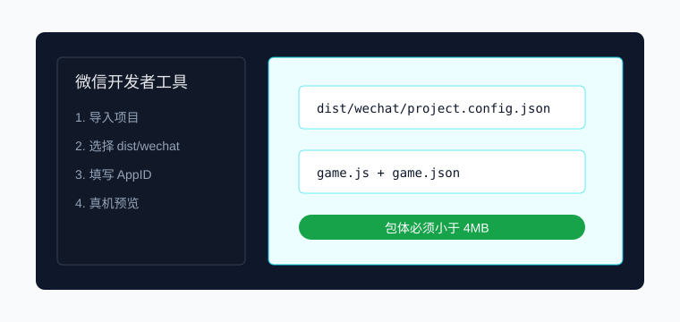

# 微信小游戏上架全流程操作手册

本文面向使用 OmniCore 发布微信小游戏的开发者，覆盖从构建、导入、真机调试到提审的完整流程。



## 1. 构建小游戏包

```bash
npm run build:wechat -- --source dist --out dist/wechat
```

构建脚本会复制小游戏入口文件，生成 `project.config.json`、`game.json` 和 `wechat-build-report.json`。输出目录总包体超过 4MB 时会直接报错并中断构建，并在错误信息与报告中输出最大的文件和目录明细。

包体红线配置：

```bash
npm run build:wechat -- --source dist --out dist/wechat --limit-bytes 4194304
```

`wechat-build-report.json` 会包含：

- `bytes`：最终输出目录总字节数。
- `limitBytes`：当前红线，默认 4MB。
- `largestFiles`：最大文件列表，用于定位大图、音频或未压缩脚本。
- `largestDirectories`：最大目录列表，用于判断是否需要分包、远程资源或 OBundle。

debug 真机调试包：

```bash
npm run build:wechat -- --source dist --out dist/wechat --debug
```

debug 模式会生成 `omnicore-debug-proxy.js`，并在微信开发者工具调试器中通过 `console.info` 定时打印核心运行时状态，默认包含 `player.x` 和 `player.hp`。项目启动后也可以手动调用：

```js
GameGlobal.__OMNICORE_DEBUG_PROXY__.install({
  game,
  keys: ['player.x', 'player.hp']
});
```

## 2. 导入微信开发者工具

1. 打开微信开发者工具。
2. 选择“小程序/小游戏项目”。
3. 项目目录选择 `dist/wechat`。
4. AppID 使用正式 AppID；无 AppID 时可用测试号先验证。
5. 进入后确认左侧文件树包含 `game.js`、`game.json`、`project.config.json`。

## 3. 本地预览与真机调试

1. 点击“编译”，确认模拟器无红色错误。
2. 打开“调试器 Console”，检查 `OmniCore WeChat Debug` 日志。
3. 点击“预览”生成二维码。
4. 用目标测试手机扫码。
5. 在真机调试面板确认 `player.x` 会随移动变化，`player.hp` 和 Store 状态一致。

## 4. 上架前检查

| 检查项 | 通过标准 |
| --- | --- |
| 包体 | `wechat-build-report.json` 中 `pass: true`，总大小小于 4MB，并检查 `largestFiles` / `largestDirectories` 无异常大资源 |
| 首屏 | 模拟器和真机均能进入首场景 |
| 日志 | release 包无未处理 error，debug 包能打印 Store 关键字段 |
| 资源 | 图片、音频、JSON 无 404 |
| 存档 | 首次安装、覆盖安装、清缓存后三种路径都能启动 |

## 5. 提交审核

1. 在微信开发者工具中点击“上传”。
2. 填写版本号和更新说明。
3. 登录微信公众平台，进入“版本管理”。
4. 选择体验版，完成测试账号验证。
5. 提交审核，按平台要求补充类目、隐私说明和素材截图。

## 常见问题

包体超过 4MB：先查看报错中的 `Largest files` 和 `Largest directories`，删除 source map，把大图和音频放入分包、远程资源或 OBundle，重新运行 `npm run build:wechat`。

真机没有 debug 日志：确认使用了 `--debug` 构建，并且调试器 Console 过滤级别没有隐藏 info。

模拟器能跑但真机白屏：优先检查资源大小写、远程域名白名单和 `wx.request` 网络权限。
