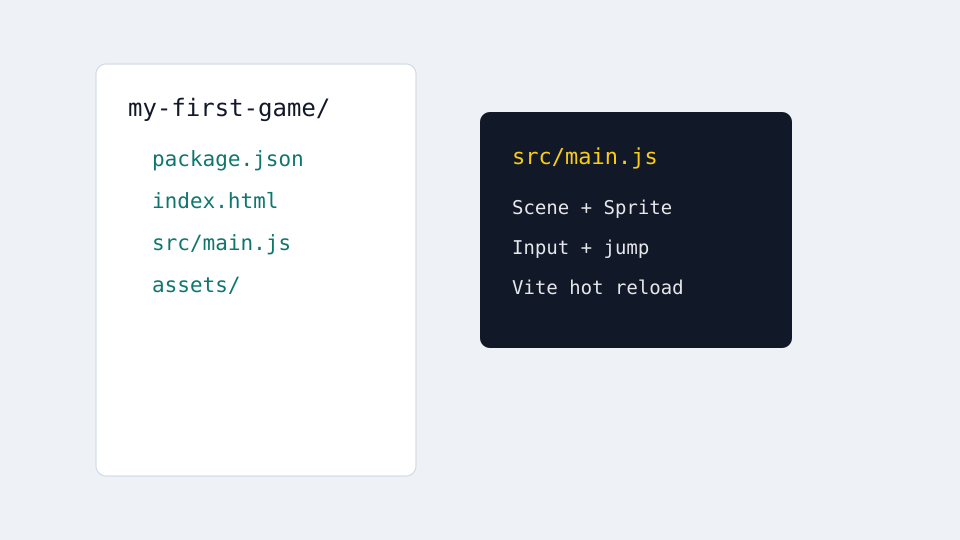
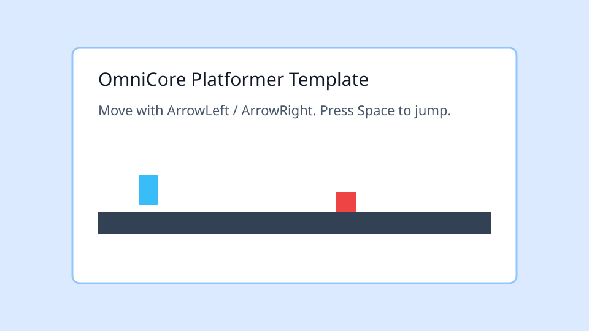
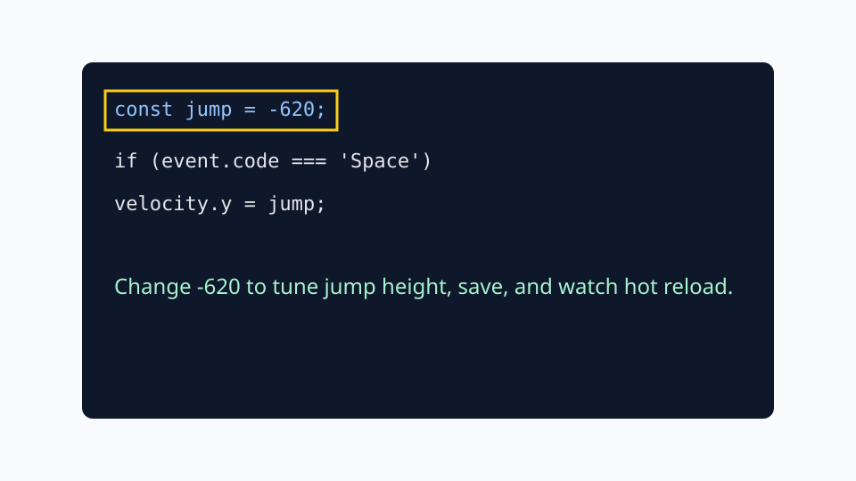

# Visual Quickstart

This visual guide mirrors the text quickstart for beginners who prefer screenshots before code.

## 1. Create the project


Run:

```bash
npx create-omnicore-app my-first-game --template platformer
```

Expected result: a new project folder with `package.json`, `index.html`, `src/main.js`, and default assets.

## 2. Inspect the project tree



The first files to inspect are:

- `src/main.js`: scene and player logic.
- `index.html`: browser entry.
- `assets/`: default sprites and tile data.

## 3. Start the dev server



Run:

```bash
npm install
npm run dev
```

Open the Vite URL shown in the terminal.

## 4. Change jump behavior



Open `src/main.js`, change the jump velocity, save the file, and confirm the browser refreshes. The player should jump higher or lower depending on the value.

## 60-second video companion

The website embeds a 60 秒 quickstart video page at `website/quickstart-video.html`. Record the final MP4 with OBS or Screen Studio using this four-step storyboard.
