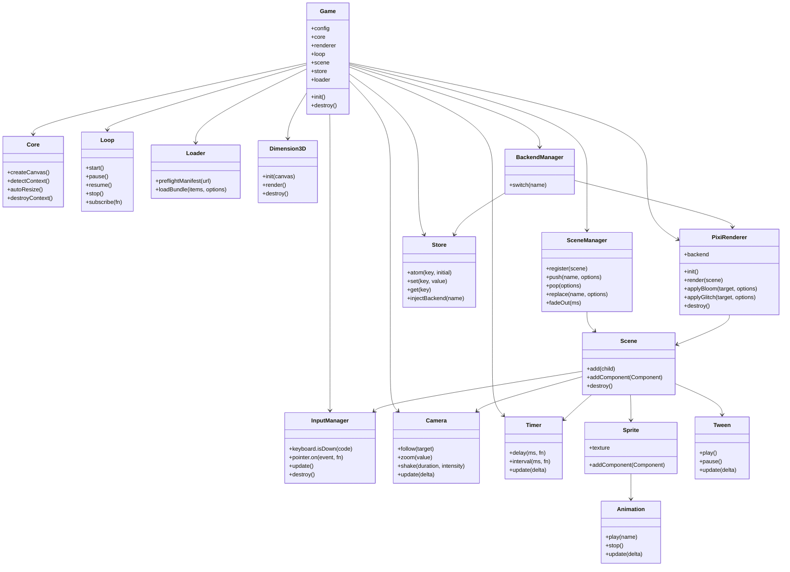

# OmniCore 设计参考备忘录

## 官方资料来源

- Phaser 3 Scenes 官方概念文档：SceneManager 负责创建、管理、更新和渲染场景；Scene 生命周期包含 `init/preload/create/update`；默认插件可配置，输入、物理、Tween 等是 Scene 级插件。参考：https://docs.phaser.io/phaser/concepts/scenes
- Phaser 3 Tween 官方类型/变更资料：Tween 支持 `from/to/start` 属性写法、`duration/yoyo/repeat/repeatDelay` 等配置以及生命周期事件。参考：https://github.com/phaserjs/phaser
- PixiJS v8 Application 官方 API：`Application.init()` 异步初始化；`app.canvas` 是渲染画布；`destroy({ removeView: true }, { children, texture, textureSource, context })` 用于释放资源。参考：https://pixijs.download/v8.17.1/docs/app.Application.html
- PixiJS filters：DisplayObject 的 `filters` 属性应用后处理；`pixi-filters` 提供 `AdvancedBloomFilter`、`AdjustmentFilter`、`GlitchFilter` 等。参考：https://pixijs.io/filters/docs/
- Construct 3 Event Sheets：事件表是事件列表，可在布局之间复用或 include。参考：https://www.construct.net/en/make-games/manuals/construct-3/project-primitives/events/event-sheets
- GDevelop Events：事件由 conditions/actions 组成，按列表顺序自上而下执行；无条件事件每帧运行。参考：https://wiki.gdevelop.io/gdevelop5/events/
- Three.js WebGLRenderer 与 GLTFLoader 官方文档/仓库：3D 背景渲染以 `renderer.render(scene, camera)` 为核心，装饰模型通过 glTF/GLB 加载，渲染器资源需要显式 dispose。参考：https://threejs.org/docs/ 和 https://github.com/mrdoob/three.js
- Kaboom.js 官方 Intro：`kaboom()` 极简初始化和组件数组组装对象是可借鉴点；物理和输入属于可选能力，不进入 OmniCore 核心。参考：https://kaboomjs.com/doc/intro
- Cocos Creator 组件文档：组件必须通过节点 `addComponent()` 创建并挂载，生命周期由节点控制。参考：https://docs.cocos.com/creator/3.8/manual/en/scripting/component.html

## 吸收点

- Phaser：OmniCore.SceneManager 采用栈式 `push/pop/replace/fadeIn/fadeOut`；OmniCore.Tween 支持 `to/from/yoyo/repeat`。
- PixiJS v8：默认 2D 后端，生命周期严格封装在 Renderer 内，不把 Pixi ticker 暴露给用户。
- Construct/GDevelop：使用 JSON-based Event Sheet，运行条件与动作，支持 include 与顺序执行。
- Three.js：OmniCore.Dimension3D 独立管理装饰性 3D canvas/scene/renderer，只加载一个静态 glTF/GLB 背景模型，不和 2D renderer 共用生命周期。
- Kaboom：`new OmniCore.Game(config)` 尽量短路径初始化。
- Cocos Creator：Scene、Sprite、UIElement 均支持 `addComponent()`。

## 避坑原则

- 不内置输入系统和物理系统；物理只通过 `OmniCore.loadPhysics(adapter)` 延迟加载。
- 不暴露 ticker 生命周期；Loop 只暴露 start/stop/pause/resume 和 frame 订阅。
- 不生成 UI 代码；仅提供原生 Canvas UI 元素绘制与事件分发辅助。
- 2D/3D 渲染分离，Dimension3D 是纯装饰背景层，销毁不触碰 2D Renderer，也不提供 3D 碰撞、动画或摄像机控制。
- 强制标准目录树，使用轻量脚手架，不依赖大型编辑器。
- Backend.switch 是实验性高级功能，必须销毁旧上下文、重建后端并重新注入 Store。

## Mermaid 类图



## /src 目录结构

```text
src/
  index.js
  core/
    OmniCore.js
    Bootstrap.js
    EventBus.js
    Timer.js
    Logger.js
  input/
    InputManager.js
  camera/
    Camera.js
  timer/
    Timer.js
  animation/
    Animation.js
  renderer/
    PixiRenderer.js
    Filters.js
  scene/
    SceneManager.js
    Scene.js
  tween/
    Tween.js
  loop/
    Loop.js
  store/
    Store.js
  loader/
    Loader.js
  math/
    Vec2.js
    Rect.js
    Easing.js
  audio/
    AudioManager.js
  data/
    DataTable.js
    I18n.js
    EventSheet.js
  net/
    NetManager.js
  debug/
    Inspector.js
  pool/
    ObjectPool.js
  compliance/
    AuthManager.js
  prefab/
    PrefabManager.js
  ui/
    UIElement.js
    Button.js
  platform/
    PlatformAdapter.js
  dimension3d/
    Dimension3D.js
```
