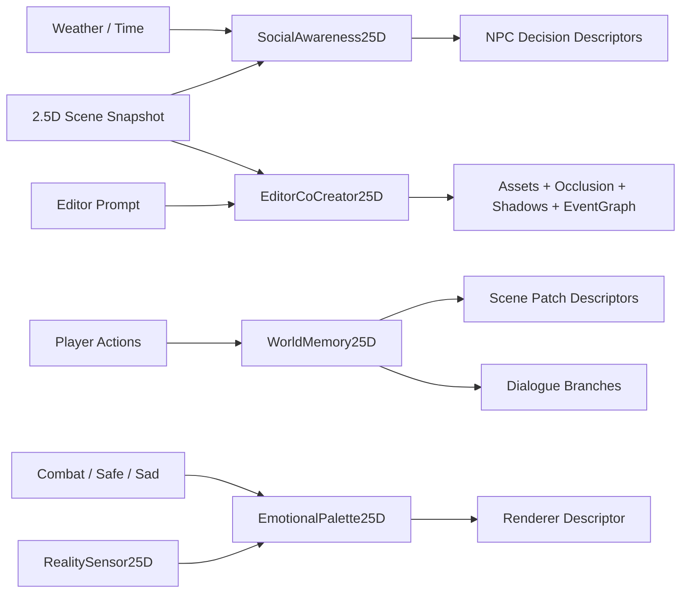

# OmniCore 2.5D Living World Design

## Goal

Build OmniCore's next 2.5D layer as a living-world system: NPCs can perform small social behaviors, the world can remember player actions, rendering can reflect emotional state, real-world sensors can influence scene ambience safely, and the editor can turn natural language into a structured 2.5D authoring plan.

## Recommended Direction

Implement this as three sequential phases on top of the existing 2.5D foundations:

1. **Phase A: Living World Runtime** - social NPC behavior and persistent scene memory.
2. **Phase B: Emotional And Mixed Reality Layer** - renderer mood descriptors and safe real-world sensor adapters.
3. **Phase C: AI Co-Creation Editor** - natural-language 2.5D authoring plans that produce assets, shadows, occlusion, and event logic descriptors.

This keeps `Dimension3D` focused on projection, model metadata, masking, and 2D/3D synchronization. The new living-world modules own behavior decisions, memory, ambience descriptors, and editor co-creation plans. That separation avoids turning `Dimension3D` into a mixed AI, narrative, rendering, and sensor subsystem.

## Current Context

The repository already has useful 2.5D foundations:

- `src/dimension3d/Dimension3D.js` owns decorative Three.js models, 2D/3D projection helpers, coordinate bias tuning, depth maps, projected colliders, fake shadows, async model loading, and viewport sync.
- `src/navigation/HeightfieldNavMesh25D.js` models height-aware grid navigation with `walk` and `jump` path actions.
- `src/audio/AudioManager.js` has 2.5D spatial audio profile work in progress.
- `src/renderer` and `src/light` related files have HD-2D filters, normal-light descriptors, volumetric fog descriptors, batching, and LOD planning in the current 2.5D industrial pipeline work.
- `packages/omnicore-editor/src/editor-app.js` already exposes editor workflow APIs, AI generation hooks, VisualEventGraph-oriented exports, 2.5D preview helpers, and fake shadow generation.
- `src/visualgraph/VisualEventGraph.js`, `src/tilemap/AITilemapGenerator.js`, and `src/importer/AIImporter.js` provide the closest existing authoring and AI-adjacent integration points.

The new work should reuse these foundations through descriptors and small runtime classes instead of introducing a separate simulation engine or external runtime dependency.

## Scope

### Included

- NPC social awareness decisions for proximity greetings, queues, and weather-based shelter behavior.
- World memory events that can persist player actions and resolve them into scene patches, NPC dialogue branches, and decorative model state changes.
- Emotional renderer descriptors for combat, safety, sadness, and custom mood states.
- Mixed reality sensor adapters for local time, optional geolocation-derived daylight, and optional device orientation tilt.
- AI co-creation planning inside the editor: text prompt in, structured 2.5D plan out.
- Focused unit tests for each phase and a small public API surface exported through `src/index.js`.

### Not Included In First Pass

- Full conversational NPC AI, language model calls at runtime, or autonomous quest generation.
- Real 3D model generation from text. Phase C outputs an asset-generation task descriptor that can later be connected to a model service.
- Permanent save-file migration tooling beyond a serializable memory snapshot shape.
- Browser permission prompts that appear automatically on page load. Permission requests must be explicit and optional.
- Full editor UI polish for every control. The first pass can expose tested app APIs and compact panels/descriptors.

## Architecture

### Phase A: Living World Runtime

Add two focused modules:

- `SocialAwareness25D`
- `WorldMemory25D`

`SocialAwareness25D` accepts a frame snapshot:

```js
const decisions = social.evaluate({
  npcs,
  player,
  locations,
  weather,
  now
});
```

It returns deterministic decision descriptors:

```js
[
  {
    type: 'greet',
    actorId: 'merchant',
    targetId: 'guard',
    animation: 'nod',
    reason: 'proximity:friendly'
  },
  {
    type: 'queue',
    actorId: 'villager-a',
    locationId: 'shop-counter',
    slot: 1,
    position: { x: 96, y: 128, z: 0 }
  },
  {
    type: 'shelter',
    actorId: 'child',
    locationId: 'awning-east',
    groupId: 'rain-shelter:awning-east'
  }
]
```

The class should not mutate entities directly. It returns descriptors so `Scene`, editor preview, tests, and game code can consume the same output. Determinism matters: the same inputs should produce the same decisions unless a seeded random source is explicitly passed.

`WorldMemory25D` records and resolves world events:

```js
memory.record({
  type: 'boss-defeated',
  id: 'boss-market-square',
  actorId: 'hero',
  locationId: 'blacksmith',
  tags: ['combat', 'public'],
  at: 1720000000000
});
```

It exposes:

- `snapshot()` - serializable state for Store/save systems.
- `restore(snapshot)` - rebuilds memory from saved state.
- `resolveScenePatches(scene)` - returns building/model/entity patch descriptors.
- `resolveDialogue(npcId, context)` - returns dialogue branch metadata based on remembered actions.

Scene patch examples:

```js
{
  entityId: 'blacksmith',
  patch: {
    variant: 'scarred',
    decals: ['broken-window', 'smoke-stain'],
    depthMap: { baselineY: 144 }
  },
  reason: 'memory:boss-defeated'
}
```

Dialogue branch examples:

```js
{
  npcId: 'merchant',
  lineId: 'saw-fire-skill',
  text: '上次那招火焰把整个广场都吓醒了。',
  reason: 'memory:skill-used-nearby'
}
```

### Phase B: Emotional And Mixed Reality Layer

Add two modules:

- `EmotionalPalette25D`
- `RealitySensor25D`

`EmotionalPalette25D` maps gameplay state to renderer descriptors:

```js
palette.resolve({
  mood: 'combat',
  intensity: 0.8
});
```

Returns:

```js
{
  pipeline: 'omnicore-25d-emotional-palette/v1',
  colorTemperature: -1800,
  saturation: 0.92,
  vignette: { strength: 0.42, color: '#4a0505' },
  tint: { color: '#ff3b30', amount: 0.18 },
  transitionMs: 350
}
```

Built-in moods:

- `combat`: red tint, darker vignette, slightly lower saturation.
- `safe`: warm gold tint, softened vignette.
- `sad`: blue tint, reduced saturation, lower contrast.
- `neutral`: no forced tint; lets the renderer reset smoothly.

The descriptor should remain renderer-agnostic. Pixi/WebGPU/Canvas backends can choose how much of it they support.

`RealitySensor25D` provides explicit, safe adapters:

```js
const sensors = new RealitySensor25D({ window, navigator });
const sample = await sensors.sample({
  daylight: true,
  orientation: true,
  geolocation: false
});
```

Returns:

```js
{
  daylight: { source: 'local-time', phase: 'night', intensity: 0.2 },
  orientation: { source: 'unavailable', tiltX: 0, tiltY: 0 },
  permissions: { geolocation: 'not-requested', orientation: 'unavailable' }
}
```

Rules:

- Do not request geolocation unless the caller explicitly asks.
- If geolocation is unavailable, use local time fallback.
- If device orientation is unavailable, return zero tilt with `source: 'unavailable'`.
- Never throw for unsupported browser APIs; return capability status.

### Phase C: AI Co-Creation Editor

Add an editor-side planning module:

- `EditorCoCreator25D`

It turns natural language into a deterministic authoring plan:

```js
const plan = coCreator.plan({
  prompt: '在这片树林后建一个高塔，塔顶有一把剑',
  scene,
  terrain,
  availableAssets
});
```

Returns:

```js
{
  protocol: 'omnicore-editor-25d-cocreation/v1',
  intent: {
    structure: 'tower',
    placement: { relation: 'behind', anchor: 'forest' },
    prop: { type: 'sword', relation: 'on-top' }
  },
  assets: [
    { kind: 'model-task', name: 'forest-tower', prompt: 'high tower behind forest' },
    { kind: 'model-task', name: 'tower-sword', prompt: 'sword on tower roof' }
  ],
  occlusion: [
    { entityId: 'forest-tower', baselineY: 180, depth: 12 }
  ],
  shadows: [
    { entityId: 'forest-tower', type: 'ellipse', opacity: 0.28 }
  ],
  eventGraph: {
    format: 'OmniCore.VisualEventGraph',
    nodes: [
      { id: 'inspect-sword', type: 'trigger', label: 'Player inspects sword' }
    ]
  }
}
```

The first pass should use simple deterministic parsing for known spatial phrases such as `behind`, `in front of`, `on top`, `near`, and Chinese equivalents like `后`, `前`, `旁边`, `塔顶`. Later versions can replace the parser with a model-backed planner without changing the plan protocol.

## Data Flow



## Error Handling

- Social decisions ignore malformed NPC entries and include diagnostics when `debug: true`.
- World memory rejects events without `type` and stores a bounded event history to avoid unbounded save growth.
- Scene patches must be descriptors, not direct mutations. Consumers can validate entity IDs before applying.
- Emotional palettes clamp intensity to `0..1` and always return a reset-capable neutral descriptor.
- Reality sensors never throw for missing browser APIs. Permission denial is returned as data.
- Co-creation parser returns `confidence` and `warnings` when a prompt cannot be fully mapped to known scene anchors.

## Public API Shape

Exports through `src/index.js`:

```js
export {
  SocialAwareness25D,
  WorldMemory25D,
  EmotionalPalette25D,
  RealitySensor25D,
  EditorCoCreator25D
};
```

Editor API additions:

```js
app.plan25DCoCreation({ prompt, scene, terrain, availableAssets });
app.previewLivingWorld25D({ npcs, player, locations, weather });
app.previewWorldMemory25D({ events, scene });
```

The editor APIs should be thin wrappers around the shared classes where possible.

## Testing Strategy

### Phase A Tests

Create `tests/living-world-25d.test.js`:

- NPCs within greeting radius and compatible tags produce a `greet` decision.
- Multiple NPCs targeting a shop counter produce stable queue slots.
- Rain weather routes NPCs with `needsShelter` to the closest shelter location.
- Boss defeat memory resolves to a building scar patch.
- Skill use near an NPC resolves to a changed dialogue branch.
- Memory snapshot and restore preserve event-derived patches.

### Phase B Tests

Create `tests/emotional-mixed-reality-25d.test.js`:

- `combat`, `safe`, `sad`, and `neutral` return stable renderer descriptors.
- Intensity is clamped and transition values remain numeric.
- Local time fallback produces daylight phase without geolocation.
- Geolocation permission denial returns status data instead of throwing.
- Missing device orientation returns zero tilt and `source: 'unavailable'`.

### Phase C Tests

Create `tests/editor-cocreation-25d.test.js`:

- Chinese prompt for tower behind forest produces tower and sword asset tasks.
- Plan includes occlusion baseline, fake shadow descriptor, and VisualEventGraph node.
- Unknown anchor returns warning and low confidence without crashing.
- Editor app wrapper exposes the same plan protocol.

### Integration Tests

Extend or create `tests/omnicore-25d-living-world-suite.test.js`:

- A remembered boss defeat changes social dialogue and emotional palette in the same scenario.
- Co-created tower plan can be converted into scene patch descriptors consumed by `WorldMemory25D`.

## Documentation

Add `docs/25d-living-world.md` with:

- Overview of the three phases.
- Short examples for NPC social decisions, world memory patches, emotional palette descriptors, sensor fallback, and editor co-creation plans.
- Clear note that runtime social/memory systems are deterministic and local by default.
- Clear note that browser permissions are optional and must be user-triggered.

## Rollout Plan

1. Implement **A1 SocialAwareness25D** and its docs/tests.
2. Implement **A2 WorldMemory25D** and its docs/tests.
3. Implement **B1 EmotionalPalette25D** and renderer descriptor docs/tests.
4. Implement **B2 RealitySensor25D** and permission fallback docs/tests.
5. Implement **C1 EditorCoCreator25D** and editor wrapper docs/tests.
6. Add the integration suite and final docs pass.

Each step should be independently shippable and should avoid modifying unrelated renderer/editor behavior beyond exports and thin wrappers.

## Open Decisions

- Use deterministic rule-based AI for Phase C first. External model integration is explicitly a later adapter.
- Use descriptors instead of direct mutations for all systems. Runtime/game code decides when to apply descriptors.
- Keep social behavior small and ambient. The first pass should create believable minor interactions, not full simulation of relationships, schedules, or economy.
- Keep mixed reality opt-in. No automatic geolocation permission prompt.

## Success Criteria

- Developers can add NPC social behavior with data-only location/NPC descriptors.
- Developers can persist world memory and resolve it into stable scene patches.
- Renderer backends can consume emotional palette descriptors without new dependencies.
- Browser sensor absence or denial never breaks the game.
- Editor can convert a natural-language 2.5D prompt into a testable authoring plan.
- All new systems have focused Vitest coverage and documentation.
