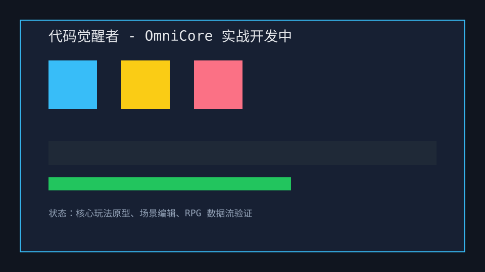

# 商业案例与实战验证

## 代码觉醒者

《代码觉醒者》是一款开发中的 2D RPG/解谜混合项目，用于验证 OmniCore 在真实游戏中的场景切换、RPG 数据配置、事件表状态机、运行时实体编辑和移动端性能表现。

- 发布证据：微信小游戏构建脚本、4MB 包体门禁、真机调试手册和 `test:wechat`。
- 质量门禁：lint、全量测试、benchmark、security-check、production-ready。
- 引擎特性：Canvas/Pixi 双后端、EventSheet 状态机、Tilemap Chunk、Matter 碰撞掩码、EditorPanel、Worker 数据同步。
- 3D 使用边界：赛博朋克城市模型只作为旋转背景层，不参与 3D 碰撞、3D 动画或 3D 摄像机控制。

## Starter Platformer

Starter Platformer 是面向新用户的可运行模板，目标是 10 分钟内完成角色移动、jump、碰撞、资源加载和 Web 预览。

- 发布证据：`examples/template-platformer`、`docs/getting-started.md`、`DEBUGGING.md`、postbuild 浏览器验证。
- 质量门禁：模板调试手册要求检查 `npm test`、`npm run dev`、Console error/warn 和资源 404。
- 引擎特性：Scene、Sprite、Input、PhysicsWorld、AssetLoader、Store。
- 市场价值：降低 Phaser、Construct、GDevelop 用户试用 OmniCore 的门槛。

## Desktop Low-Code Suite

Desktop Low-Code Suite 是面向创作者和小团队的编辑器案例，覆盖 Electron 桌面壳、工作区扫描、资产预览、Prefab 变体、可视化事件图、UI_Layout 和 config/data.json 数据表编辑。

- 发布证据：`omnicore-editor.exe`、`OmniCore Editor.dmg`、`OmniCore Editor.AppImage` 打包目标。
- 质量门禁：`desktop-editor-workflow`、`lowcode-editor-suite`、`editor-industrial-authoring`、`marketplace-platform` 测试。
- 引擎特性：低代码事件图、行为树导出、UI 编辑、规则瓦片、数据库表格、自动保存恢复。
- 市场价值：补齐和 Unity/Godot/Cocos 对比时最薄弱的编辑器深度与生产流证明。
